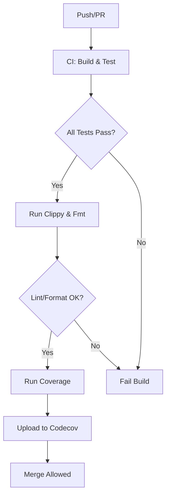
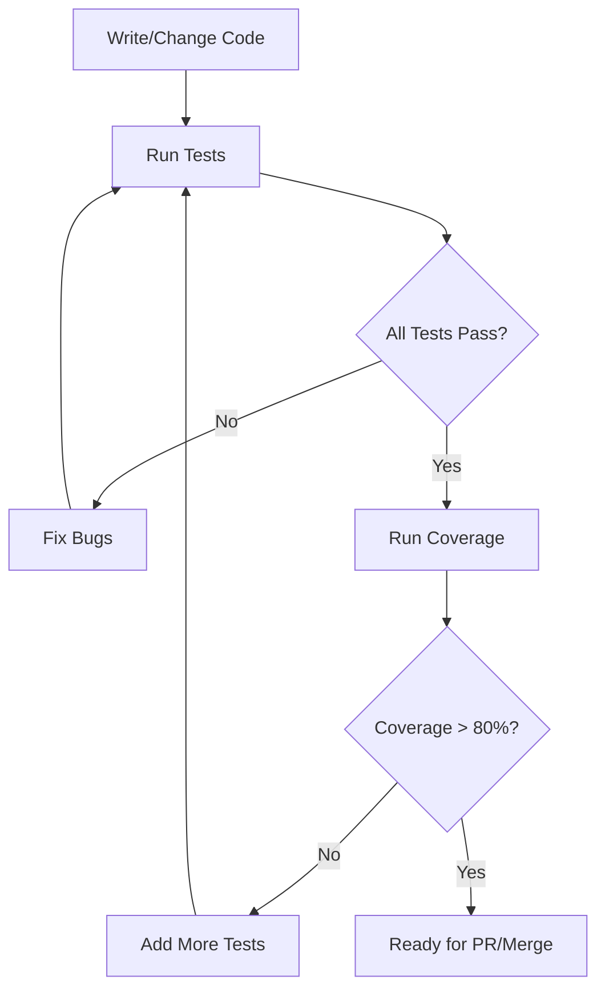
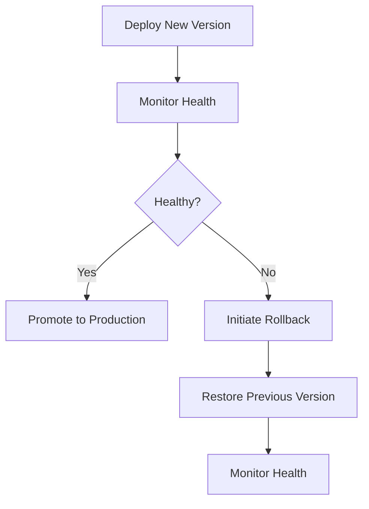
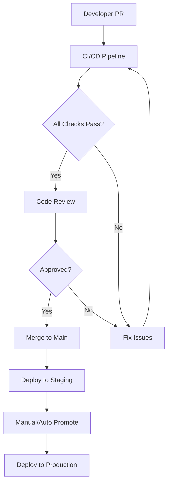
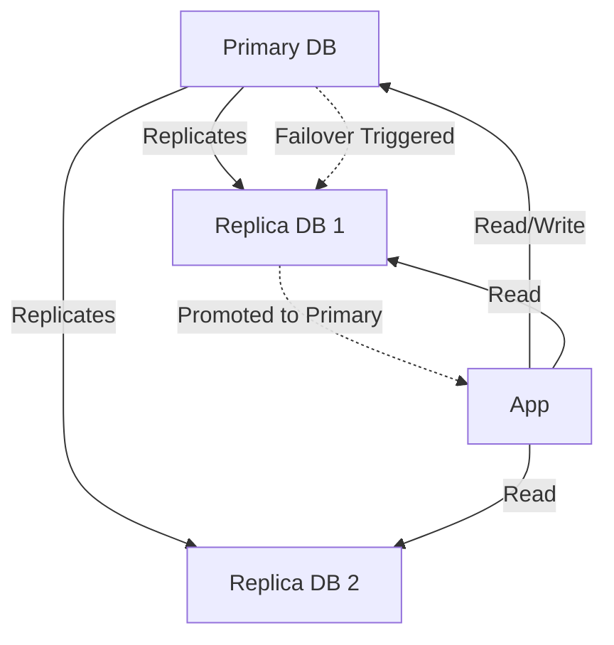
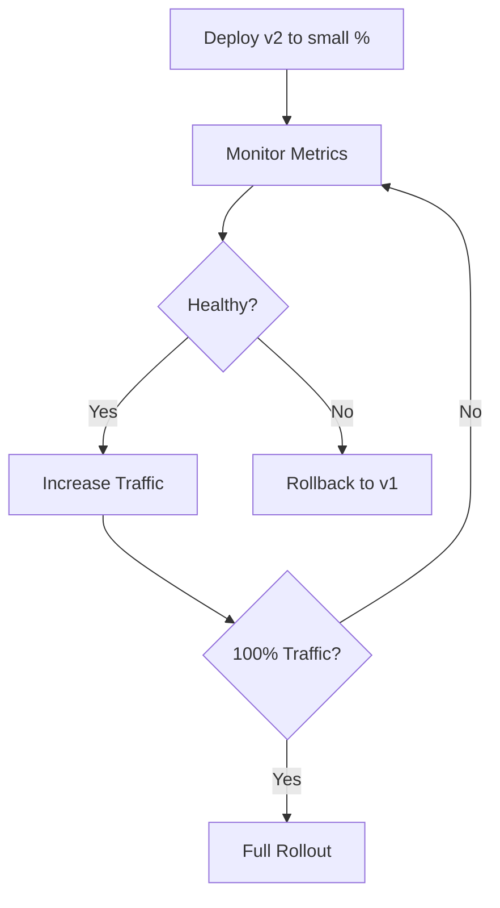
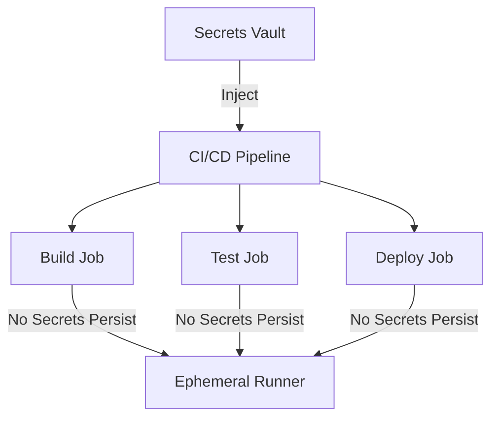
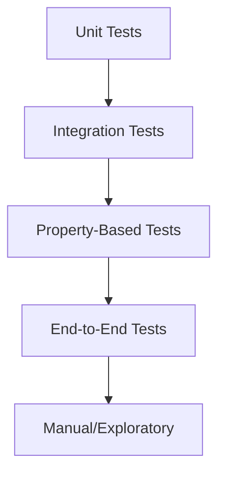

# Deployment, CI/CD, and Quality Assurance Guide

## 1. Running and Interpreting Test Results

- Run all tests:
  ```sh
  cargo test --workspace --all-features
  ```
- **Success:** All tests pass (green). Your code is robust for the tested scenarios.
- **Failure:** Review the error output. For property-based tests, the failing input will be minimized and shown. Fix the bug or adjust the test if the failure is expected.
- **Concurrency tests:** If you see panics or race conditions, investigate thread safety in your code.

## 2. Coverage Reporting

- Install and run Tarpaulin:
  ```sh
  cargo install cargo-tarpaulin
  cargo tarpaulin --workspace --all-features --out Html
  # Open target/tarpaulin-report.html in your browser
  ```
- **Coverage < 80%:** Add more tests, especially for error paths and edge cases.
- **Coverage 80-95%:** Good, but review untested code for critical logic.
- **Coverage > 95%:** Excellent, but ensure tests are meaningful (not just covering lines, but logic).

## 3. CI/CD Best Practices

- Use GitHub Actions or another CI system to run tests, lint, and coverage on every push/PR.
- Fail the build on any test, lint, or format error.
- Upload coverage reports to a service like Codecov for tracking over time.
- Use branch protection rules to require passing CI before merging.

### Example GitHub Actions Workflow
```yaml
name: Rust CI
on: [push, pull_request]
jobs:
  build-and-test:
    runs-on: ubuntu-latest
    steps:
      - uses: actions/checkout@v3
      - name: Install Rust
        uses: actions-rs/toolchain@v1
        with:
          toolchain: stable
          override: true
      - name: Install Tarpaulin
        run: cargo install cargo-tarpaulin
      - name: Run tests
        run: cargo test --workspace --all-features --all-targets
      - name: Run clippy
        run: cargo clippy --workspace --all-features --all-targets -- -D warnings
      - name: Run fmt
        run: cargo fmt --all -- --check
      - name: Run coverage
        run: cargo tarpaulin --workspace --all-features --out Xml
      - name: Upload coverage to Codecov
        uses: codecov/codecov-action@v3
        with:
          files: ./cobertura.xml
```

## 4. Visualizing CI/CD and Test Flows

### CI/CD Pipeline (Mermaid)


### Test & Coverage Feedback Loop (Mermaid)


### Rollback/Recovery Flow (Mermaid)


### Blue/Green Deployment (Mermaid)
```mermaid
graph TD
  A[Blue Environment (Live)]
  B[Green Environment (Staging)]
  C[Deploy New Version to Green]
  D[Test Green]
  E[Switch Traffic to Green]
  F[Green Becomes Live]
  G[Blue Becomes Staging]
  A --> C
  C --> D
  D --> E
  E --> F
  F --> G
```

### Release Flow (PR to Production) (Mermaid)


## 5. Troubleshooting

### Common Issues & Solutions
- **Test fails only in CI:**
  - Check for missing environment variables, file permissions, or OS differences.
  - Use `println!` or logging to debug in CI logs.
- **Coverage unexpectedly low:**
  - Ensure all test files are included and not ignored by `#[cfg(test)]` or workspace settings.
  - Add tests for error paths and rarely-used code branches.
- **Race conditions in concurrency tests:**
  - Use `Arc<Mutex<...>>` for shared state.
  - Add `std::thread::sleep` to simulate timing issues and flush out races.
- **Property-based test fails with minimal input:**
  - Investigate the failing input shown by proptest; it’s often a real edge case.
- **Clippy or fmt fails in CI but not locally:**
  - Ensure you’re using the same Rust toolchain version locally and in CI.

## 6. Domain-Specific Diagrams

### Database Failover & Replication (Mermaid)
A typical HA database setup with primary/replica and automatic failover.


### Canary Release Flow (Mermaid)
Gradually shift traffic to a new version, monitoring for issues before full rollout.


### Secure Secrets Management in CI/CD (Mermaid)
How secrets are injected securely into build/test/deploy jobs.


### Test Pyramid for Rust Projects (Mermaid)
Recommended balance of test types for robust quality.


---
*For more, see: [Rust CI Book](https://rust-lang.github.io/rustup-components-history/), [Tarpaulin Docs](https://docs.rs/cargo-tarpaulin/), [Codecov](https://about.codecov.io/)* 