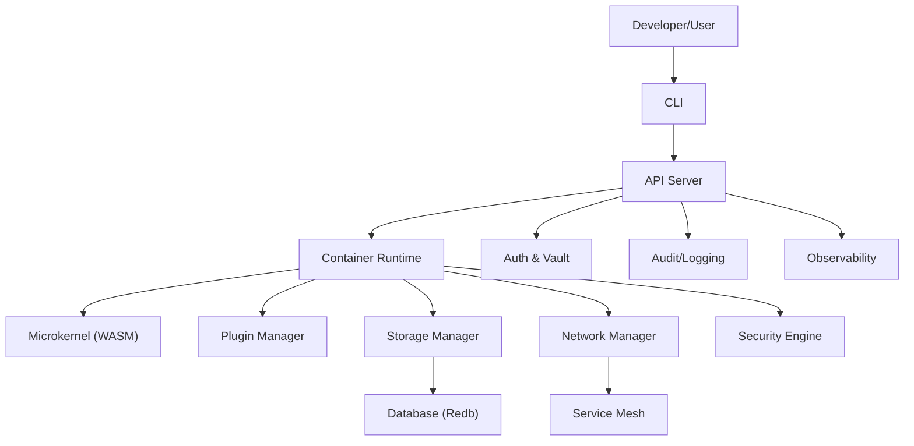

# High-Level System Architecture (HLA)

*This document details the ForgeOne architecture for MNC-grade, production-ready deployments, with explicit mapping to enterprise compliance, operational, and business requirements.*

## 1. System Overview

ForgeOne is a next-gen, production-grade containerization platform for ultra-secure, high-performance, and developer-friendly infrastructure at MNC scale. The architecture is based on the Distributed Microservices Container Orchestration Architecture (DMCOA) pattern, featuring a Rust-based microkernel, modular plugin system, and zero-trust security by default. All design choices are validated against SOC2, ISO 27001, GDPR, and enterprise SLAs.

## 2. Atomic Structure & Core Modules

```
forge-one/
├── cli/                # Rust CLI frontend for commands
├── common/             # Shared modules: config, secrets, logging, telemetry, audit
├── daemon/             # Daemon process manager, orchestrator
├── runtime/            # Wasm + runc-based execution logic
├── network/            # Reverse proxy, DNS, service mesh
├── auth/               # RBAC, API Keys, MFA, token & policy engine
├── vault/              # Key & secrets store (RedB-based)
├── db/                 # Advanced RedB + SQLite-alternative DB with hyper compression
├── forgefile/          # DSL to define container specs & infra
├── plugins/            # Plugin system for external provider extensions
├── observability/      # Telemetry, metrics, live performance stream
├── dsm/                # Self-healing systems: DSM, AI/Auto-recovery
├── ui/                 # GUI Frontend (Web GUI + WebAssembly)
├── apiserver/          # Secure REST API server (WebURL, token control)
├── examples/           # Demonstration apps
├── docs/               # Complete documentation
├── tests/              # Unit, integration, and delta stress tests
└── Cargo.toml          # Root manifest for Rust workspace
```

## 3. Detailed Module Responsibilities

### 3.1 CLI
- **Production:** Secure, auditable command execution; supports automation and scripting.
- **Compliance:** All actions logged, RBAC enforced, MFA for sensitive ops.
- **Ops Guarantees:** CLI errors, audit logs, and user actions are traceable.

### 3.2 Common
- **Production:** Centralized config, secrets, telemetry, and audit.
- **Compliance:** Immutable audit logs, config attestation, evidence for SOC2/ISO 27001.
- **Ops Guarantees:** All config changes are versioned and auditable.

### 3.3 Daemon
- **Production:** Manages service lifecycle, supervised workers, self-restart.
- **Compliance:** Health checks, uptime SLAs, incident logging.
- **Ops Guarantees:** Automatic failover, restart, and alerting.

### 3.4 Runtime
- **Production:** runc/WASM, snapshot recovery, FS layers, OCI-compliant.
- **Compliance:** Container provenance, runtime attestation, image scanning.
- **Ops Guarantees:** Rollback, hot-patching, and forensic replay.

### 3.5 Network
- **Production:** Zero-trust, encrypted, reverse proxy, VPN, DNS, load balancer.
- **Compliance:** Network segmentation, mTLS, firewall audit logs.
- **Ops Guarantees:** Real-time metrics, DDoS protection, failover.

### 3.6 Auth
- **Production:** MFA, RBAC/ABAC, JWT, API keys, secure tokens.
- **Compliance:** SSO integration, access reviews, audit trails.
- **Ops Guarantees:** Just-in-time access, privilege escalation alerts.

### 3.7 Vault
- **Production:** Encrypted secrets, key rotation, Redb-backed.
- **Compliance:** Key management, access logging, evidence for audits.
- **Ops Guarantees:** Automated secret rotation, backup, and restore.

### 3.8 DB
- **Production:** Redb-based, ACID, compressed, auto-checkpointed, live streams.
- **Compliance:** Data retention, backup, and encryption at rest.
- **Ops Guarantees:** Point-in-time recovery, DR, and failover.

### 3.9 Forgefile
- **Production:** DSL for build/deploy/network/secrets, compressed, validated.
- **Compliance:** Policy-as-code, config validation, change tracking.
- **Ops Guarantees:** Automated deployment, rollback, and audit.

### 3.10 Plugins
- **Production:** Extensible API, build.rs/hooks, provider SDKs.
- **Compliance:** Plugin signing, sandboxing, supply chain validation.
- **Ops Guarantees:** Hot-swap, versioning, and runtime isolation.

### 3.11 Observability
- **Production:** OpenTelemetry, Prometheus, live metrics, span streams.
- **Compliance:** Immutable logs, evidence for SIEM/SOC2.
- **Ops Guarantees:** Real-time dashboards, alerting, and root cause analysis.

### 3.12 DSM
- **Production:** Distributed self-healing, rollback, AI anomaly prediction.
- **Compliance:** Incident evidence, automated remediation logs.
- **Ops Guarantees:** Health checks, auto-recovery, and event-driven remediation.

### 3.13 UI
- **Production:** Web GUI, status, logs, metrics, forgefile builder.
- **Compliance:** RBAC, audit logs, SSO, and MFA.
- **Ops Guarantees:** User activity tracking, error reporting.

### 3.14 Apiserver
- **Production:** Secure REST API, token control, multi-tenant.
- **Compliance:** API rate limiting, endpoint audit, access control.
- **Ops Guarantees:** Versioned endpoints, error handling, and monitoring.

## 4. Deployment Topologies

### 4.1 Multi-Region, Multi-Cluster, HA, DR
- **Dev:** Single-node, full feature set, local dev.
- **Test:** Multi-node, integration, simulated prod.
- **Staging:** Prod-like, isolated, full monitoring.
- **Production:** Multi-region, multi-cluster, HA, DR, autoscaling.



- **HA:** Active-active clusters, load balancing, auto-failover.
- **DR:** Cross-region replication, backup, and restore.
- **Compliance:** Data residency, encryption, and audit for all regions.

## 5. Integration Points & Compliance Implications
- **CI/CD:** Automated build, test, deploy, and compliance checks.
- **SSO:** SAML, OIDC, LDAP/AD, MFA for all user access.
- **Cloud:** Multi-cloud, hybrid, and on-prem support; cloud-native compliance.
- **SIEM:** Real-time log streaming to SIEM/SOC for audit and incident response.
- **Monitoring:** Prometheus, Grafana, OpenTelemetry for metrics and alerting.
- **Compliance:** All integrations must log, audit, and enforce policy.

## 6. Non-Functional Requirements
- **Performance:** <500ms startup, 1000+ containers/host, <100ms API, 1000+ devs.
- **Security:** Zero Trust, mTLS, RBAC, MFA, audit, image scanning, runtime monitoring.
- **Reliability:** 99.99% uptime, self-healing, backup/recovery, graceful degradation.
- **Scalability:** 10,000+ containers, multi-region, autoscaling, cost optimization.
- **Compliance:** SOC2, ISO 27001, GDPR, CIS Benchmarks.

## 7. Traceability
- Every architectural decision is mapped to a business, compliance, or operational requirement.
- All modules and integrations are versioned, auditable, and traceable.
- Evidence is generated for every compliance and audit requirement.

## 8. Production Readiness Checklist
- [ ] All modules have production, compliance, and operational guarantees documented.
- [ ] Deployment topology is validated for HA, DR, and compliance.
- [ ] All integrations (CI/CD, SSO, SIEM, etc.) are tested and auditable.
- [ ] Non-functional requirements are met and validated.
- [ ] Traceability from architecture to business/compliance/ops is documented.
- [ ] All logs, metrics, and evidence are available for audit.
- [ ] Security controls (Zero Trust, RBAC, MFA, mTLS) are enforced and tested.
- [ ] Compliance mapping (SOC2, ISO 27001, GDPR) is complete and up-to-date.
- [ ] Go-live sign-off from architecture, security, and compliance leads.
