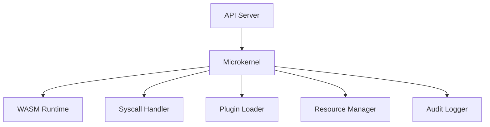
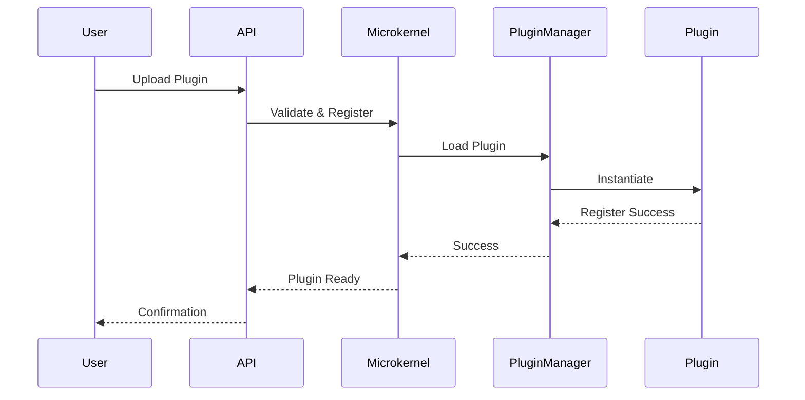
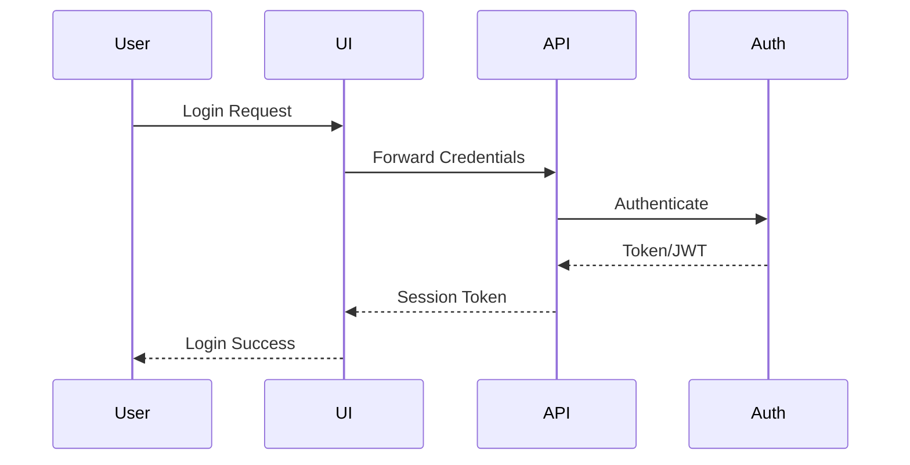
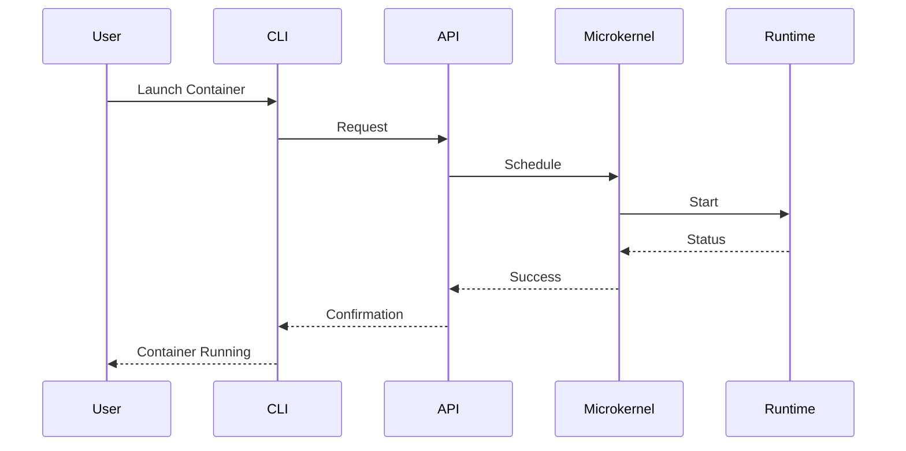
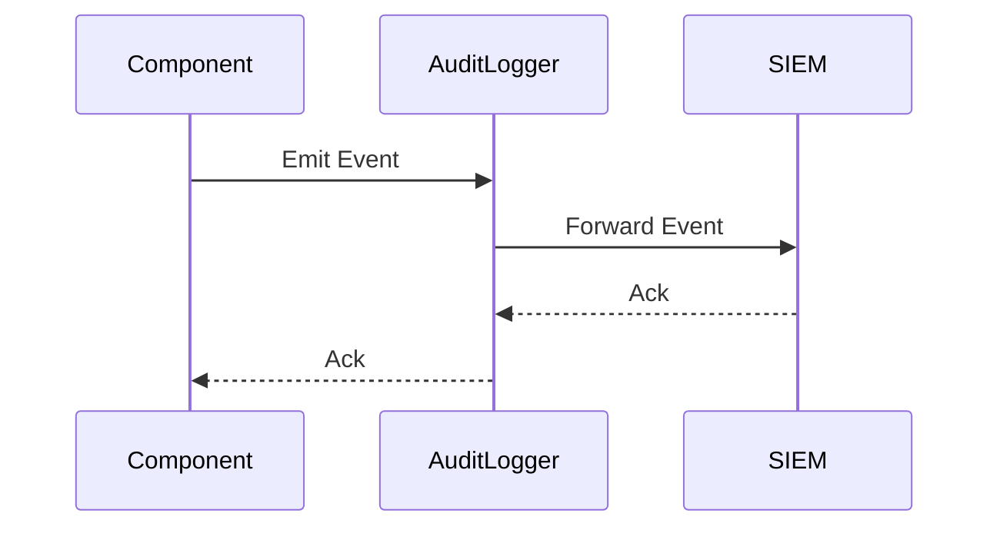

# Low-Level Design (LLD)

*This document provides a deeply detailed, MNC-grade, production-ready low-level design for ForgeOne. Every component, interface, and integration is built for security, traceability, compliance, and operational excellence.*

## 1. Component Specifications (User, Security, Compliance)

### 1.1 Microkernel (runtime/daemon)
- **Responsibilities:** Rust-based, WASM-enabled, runc integration. Handles container lifecycle, resource isolation, plugin execution. Exposes trait-based API for orchestration, plugin, and system calls. All actions are logged and auditable for compliance.
- **Security Hooks:** All syscalls, resource allocations, and plugin loads are authenticated, authorized, and logged. Policy enforcement at every syscall.
- **Compliance:** Immutable logs, runtime attestation, forensic replay, evidence for SOC2/ISO 27001.
- **Testing:** Unit tests for syscall enforcement, integration tests for plugin execution, security tests for privilege escalation, compliance tests for audit log integrity.
- **Upgrade/Rollback:** Supports hot-patching, versioned upgrades, and automated rollback with audit trail.
- **Failure Scenarios:** Node crash, plugin failure, resource exhaustion—auto-recovery, alerting, and forensic dump.
- **Compliance Evidence:** Syscall logs, plugin load attestations, rollback events.

#### Microkernel Component Diagram

### 1.2 Plugin System (plugins/)
- **Responsibilities:** WebAssembly-based plugins, ABI mapping, sandboxed. Dynamic discovery, registration, versioning, and hot-swapping. Secure hooks for external providers (cloud, storage, auth). Plugins are signed, sandboxed, and versioned for user safety and audit.
- **Security Hooks:** Plugin signature verification, sandbox enforcement, runtime policy checks.
- **Compliance:** Plugin provenance, supply chain validation, audit logs for all plugin actions.
- **Testing:** Unit tests for ABI, integration tests for plugin lifecycle, security tests for sandbox escape, compliance tests for plugin signature validation.
- **Upgrade/Rollback:** Hot-swap plugins, version rollback, audit trail for all changes.
- **Failure Scenarios:** Plugin crash, signature failure—auto-disable, alert, and forensic log.
- **Compliance Evidence:** Plugin signature logs, sandbox enforcement events, version history.

#### Plugin System Sequence Diagram

### 1.3 Auth & Security (auth/)
- **Responsibilities:** MFA, RBAC/ABAC, JWT, API keys, TOTP. Context-scoped tokens, policy engine, audit logging. mTLS for all internal/external comms. All authentication and authorization actions are logged for audit.
- **Security Hooks:** All access is authenticated, authorized, and logged. Policy engine enforces least privilege.
- **Compliance:** SSO integration, access reviews, audit trails, evidence for SOC2/ISO 27001/GDPR.
- **Testing:** Unit tests for token issuance, integration tests for SSO, security tests for privilege escalation, compliance tests for audit log completeness.
- **Upgrade/Rollback:** Policy hot-reload, versioned access control, rollback for misconfigurations.
- **Failure Scenarios:** Auth service down, token compromise—auto-revoke, alert, and forensic log.
- **Compliance Evidence:** Auth logs, access reviews, policy change history.

#### User Login Sequence Diagram

### 1.4 Storage & Vault (db/, vault/)
- **Responsibilities:** Redb-based, ACID, compressed, auto-checkpointed. Encrypted secrets, key rotation, secure injection. All storage actions are traceable and compliant.
- **Security Hooks:** All data at rest is encrypted, access is logged, and key usage is audited.
- **Compliance:** Data retention, backup, encryption at rest, evidence for GDPR/SOC2.
- **Testing:** Unit tests for CRUD, integration tests for backup/restore, security tests for unauthorized access, compliance tests for retention policy.
- **Upgrade/Rollback:** Schema migration with rollback, backup/restore validation.
- **Failure Scenarios:** Data corruption, backup failure—auto-restore, alert, and forensic log.
- **Compliance Evidence:** Backup logs, key rotation events, access logs.

### 1.5 Networking (network/)
- **Responsibilities:** Reverse proxy, VPN, DNS, service mesh, CNI plugins. Zero-trust, encrypted channels, dynamic service registry. All network actions are monitored and auditable.
- **Security Hooks:** mTLS for all connections, firewall policy enforcement, DDoS protection.
- **Compliance:** Network segmentation, audit logs, evidence for SOC2/ISO 27001.
- **Testing:** Unit tests for routing, integration tests for VPN, security tests for firewall bypass, compliance tests for log completeness.
- **Upgrade/Rollback:** Hot-reload network policies, rollback for misconfigurations.
- **Failure Scenarios:** Network partition, DDoS—auto-failover, alert, and forensic log.
- **Compliance Evidence:** Network logs, policy change history, DDoS mitigation events.

### 1.6 Observability (observability/)
- **Responsibilities:** OpenTelemetry, Prometheus, live metrics, span streams. Centralized, structured, immutable logs. Observability is integrated for user transparency and compliance.
- **Security Hooks:** All logs are tamper-evident, access is controlled and audited.
- **Compliance:** Evidence for SIEM/SOC2, log retention, and export.
- **Testing:** Unit tests for metrics, integration tests for log streaming, security tests for log tampering, compliance tests for retention/export.
- **Upgrade/Rollback:** Log schema migration, retention policy updates.
- **Failure Scenarios:** Log loss, metric drop—alert, auto-recover, and forensic log.
- **Compliance Evidence:** Log export events, retention policy logs, SIEM integration.

### 1.7 DSM (dsm/)
- **Responsibilities:** Distributed self-healing, rollback, AI anomaly prediction. Health checks, auto-recovery, event-driven remediation. All DSM actions are logged for traceability.
- **Security Hooks:** All remediation actions are policy-checked and logged.
- **Compliance:** Incident evidence, automated remediation logs, evidence for SOC2/ISO 27001.
- **Testing:** Unit tests for health checks, integration tests for rollback, security tests for unauthorized remediation, compliance tests for incident evidence.
- **Upgrade/Rollback:** Hot-patch remediation logic, rollback for failed fixes.
- **Failure Scenarios:** Remediation failure, false positive—alert, manual override, forensic log.
- **Compliance Evidence:** Incident logs, remediation events, rollback history.

### 1.8 CLI & UI (cli/, ui/)
- **Responsibilities:** CLI: Terminal UI, autocomplete, init/run/audit/logs/validate. UI: Web GUI, status, logs, metrics, forgefile builder. All user actions are logged and auditable.
- **Security Hooks:** RBAC/MFA for all sensitive actions, session logging.
- **Compliance:** User activity logs, SSO/MFA, evidence for GDPR/SOC2.
- **Testing:** Unit tests for commands, integration tests for workflows, security tests for privilege escalation, compliance tests for activity log completeness.
- **Upgrade/Rollback:** UI/CLI versioning, rollback for failed upgrades.
- **Failure Scenarios:** UI/CLI crash, session loss—auto-recover, alert, and forensic log.
- **Compliance Evidence:** User activity logs, session events, error reports.

### 1.9 Forgefile DSL (forgefile/)
- **Responsibilities:** Declarative/imperative config, validated, compressed. Build, deploy, network, secrets, lifecycle. All config changes are versioned and auditable.
- **Security Hooks:** Policy validation for all configs, audit trail for changes.
- **Compliance:** Policy-as-code, config validation, evidence for SOC2/ISO 27001.
- **Testing:** Unit tests for syntax, integration tests for deployment, security tests for policy bypass, compliance tests for change tracking.
- **Upgrade/Rollback:** DSL versioning, rollback for failed deployments.
- **Failure Scenarios:** Config error, deployment failure—auto-rollback, alert, and forensic log.
- **Compliance Evidence:** Config change logs, policy validation events, rollback history.

### 1.10 API Server (apiserver/)
- **Responsibilities:** Secure REST API, token control, multi-tenant. Rate limiting, versioned endpoints, error handling. All API actions are logged and compliant.
- **Security Hooks:** mTLS, RBAC, audit logging for all endpoints.
- **Compliance:** API access logs, rate limiting, evidence for SOC2/ISO 27001/GDPR.
- **Testing:** Unit tests for endpoints, integration tests for multi-tenancy, security tests for unauthorized access, compliance tests for log completeness.
- **Upgrade/Rollback:** API versioning, rollback for breaking changes.
- **Failure Scenarios:** API outage, rate limit breach—auto-recover, alert, and forensic log.
- **Compliance Evidence:** API access logs, rate limit events, version history.

## 2. Operational Flows & Sequence Diagrams

### 2.1 Container Launch Flow

### 2.2 Audit Event Flow

## 3. Upgrade, Rollback, and Hotfix Handling
- All components support versioned upgrades, hot-patching, and automated rollback with full audit trail.
- Rollback is triggered on failed upgrade, security incident, or compliance violation.
- Evidence of all upgrades, rollbacks, and hotfixes is logged and available for audit.

## 4. Failure Scenarios & Recovery
- Node, network, storage, or component failure triggers auto-recovery, alerting, and forensic logging.
- All recovery actions are logged and mapped to compliance requirements.
- Manual override is available for critical failures, with evidence logged.

## 5. Compliance Evidence Generation
- Every component generates immutable, versioned logs for all actions.
- Evidence is collected for SOC2, ISO 27001, GDPR, and enterprise audits.
- All logs, metrics, and events are exportable for SIEM/SOC and regulatory review.

## 6. Testing & Validation Matrix
| Component    | Unit | Integration | Security | Compliance |
|--------------|------|-------------|----------|------------|
| Microkernel  |  ✔   |     ✔       |    ✔     |     ✔      |
| Plugins      |  ✔   |     ✔       |    ✔     |     ✔      |
| Auth         |  ✔   |     ✔       |    ✔     |     ✔      |
| Storage/Vault|  ✔   |     ✔       |    ✔     |     ✔      |
| Network      |  ✔   |     ✔       |    ✔     |     ✔      |
| Observability|  ✔   |     ✔       |    ✔     |     ✔      |
| DSM          |  ✔   |     ✔       |    ✔     |     ✔      |
| CLI/UI       |  ✔   |     ✔       |    ✔     |     ✔      |
| Forgefile    |  ✔   |     ✔       |    ✔     |     ✔      |
| API Server   |  ✔   |     ✔       |    ✔     |     ✔      |

*All tests must pass before production deployment. Evidence is retained for audit.*