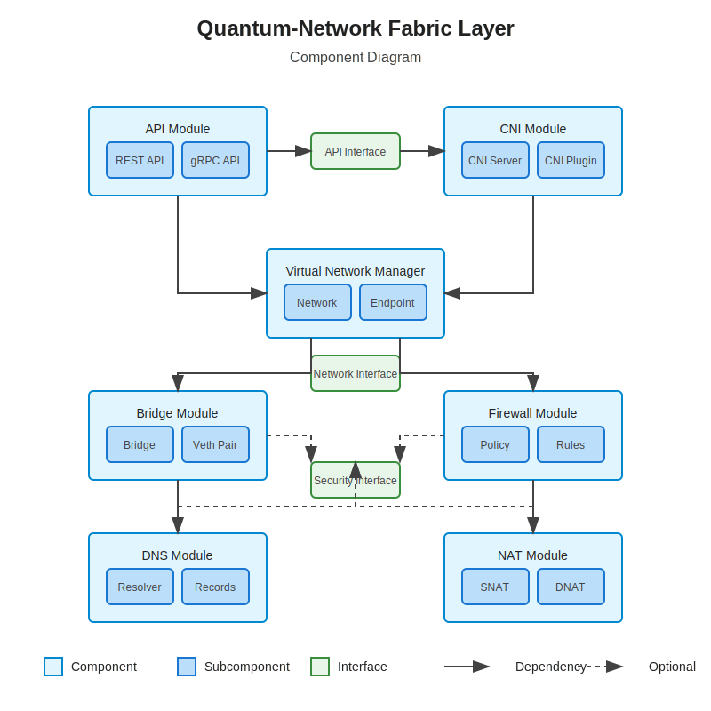
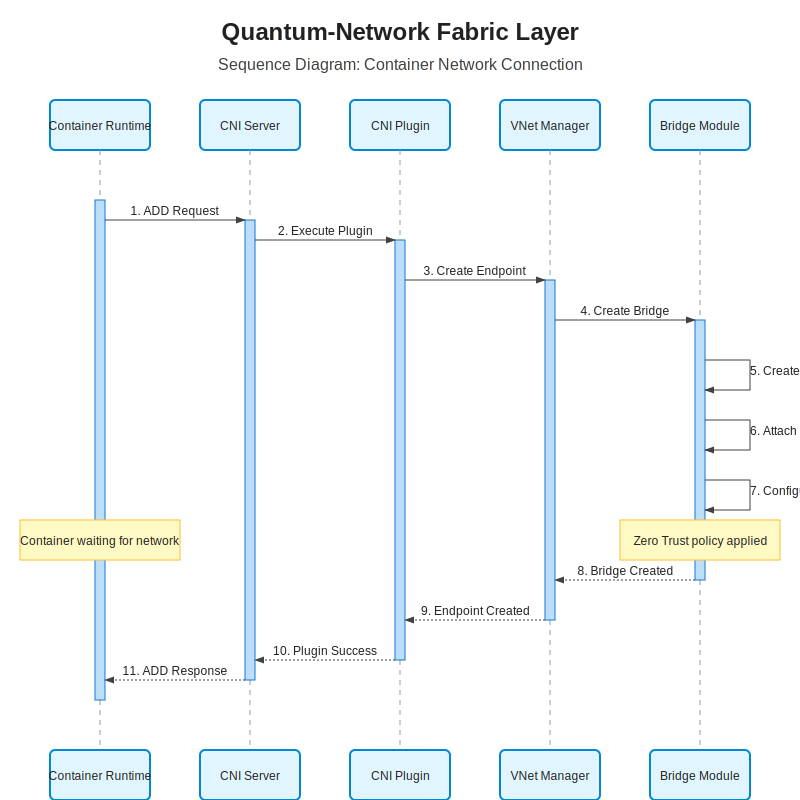

# CNI Module Documentation

## Overview

The Container Network Interface (CNI) Module is a critical component of the Quantum-Network Fabric Layer that enables container runtimes to connect containers to virtual networks. It implements the [CNI specification](https://github.com/containernetworking/cni/blob/master/SPEC.md) to provide seamless integration with container runtimes like Docker, Kubernetes, and containerd.

## Architecture

The CNI Module consists of three main components:

1. **CNI Server**: A long-running daemon that manages network configurations and handles CNI requests
2. **CNI Plugin**: An executable that container runtimes invoke directly to perform network operations
3. **CNI Manager**: A library that coordinates between the server, plugin, and virtual network manager



## CNI Server

The CNI Server is a background service that:

- Maintains network configurations for container runtimes
- Processes network requests from the CNI Plugin
- Communicates with the Virtual Network Manager to create and manage network endpoints
- Implements caching for improved performance
- Provides health checks and metrics

### Configuration

The CNI Server can be configured through the `CniServerConfig` structure:

```rust
pub struct CniServerConfig {
    pub socket_path: String,
    pub config_dir: String,
    pub cache_size: usize,
    pub log_level: String,
    pub metrics_enabled: bool,
}
```

Default configuration:
- Socket Path: `/run/quantum/cni.sock`
- Config Directory: `/etc/quantum/cni/net.d`
- Cache Size: 1000 entries
- Log Level: `info`
- Metrics: Enabled

## CNI Plugin

The CNI Plugin is an executable that container runtimes invoke directly. It:

- Receives CNI commands (ADD, DEL, CHECK, VERSION) from container runtimes
- Forwards requests to the CNI Server over a Unix socket
- Returns results to the container runtime
- Handles timeouts and error conditions

### Supported CNI Commands

- **ADD**: Creates a new network interface in the container
- **DEL**: Removes a network interface from the container
- **CHECK**: Verifies the container's networking is correctly configured
- **VERSION**: Returns the supported CNI specification versions

### CNI Configuration Format

The CNI Plugin uses the standard CNI configuration format:

```json
{
  "cniVersion": "1.0.0",
  "name": "quantum-bridge",
  "type": "quantum-cni",
  "bridge": "quantum0",
  "isGateway": true,
  "ipMasq": true,
  "hairpinMode": true,
  "ipam": {
    "type": "host-local",
    "subnet": "172.20.0.0/16",
    "routes": [
      { "dst": "0.0.0.0/0" }
    ]
  },
  "dns": {
    "nameservers": ["172.20.0.1"],
    "domain": "quantum.local",
    "search": ["quantum.local"]
  }
}
```

## CNI Manager

The CNI Manager is a library that:

- Coordinates between the CNI Server, CNI Plugin, and Virtual Network Manager
- Implements the CNI specification logic
- Manages network configurations
- Handles IPAM (IP Address Management)
- Provides error handling and logging

### Implementation

```rust
pub struct CniManager {
    vnet_manager: Arc<RwLock<VNetManager>>,
    config_store: Arc<RwLock<HashMap<String, CniNetworkConfig>>>,
    cache: Arc<RwLock<LruCache<String, Endpoint>>>,
}
```

The CNI Manager maintains thread-safe access to:
- The Virtual Network Manager for network operations
- A store of network configurations
- A cache of recently created endpoints

## Network Operations

### Container Network Setup (ADD)

When a container is created, the CNI Module performs the following steps:

1. Container runtime executes the CNI Plugin with the ADD command
2. Plugin forwards the request to the CNI Server
3. Server validates the request and calls the CNI Manager
4. CNI Manager creates a network endpoint in the appropriate virtual network
5. Virtual Network Manager configures:
   - veth pair creation
   - Bridge attachment
   - IP address assignment
   - DNS configuration
   - Firewall rules based on Zero Trust policies
6. Result is returned to the container runtime



### Container Network Cleanup (DEL)

When a container is removed:

1. Container runtime executes the CNI Plugin with the DEL command
2. Plugin forwards the request to the CNI Server
3. Server validates the request and calls the CNI Manager
4. CNI Manager removes the network endpoint
5. Virtual Network Manager cleans up:
   - veth pair removal
   - IP address release
   - Firewall rules cleanup
6. Result is returned to the container runtime

## Integration with Container Runtimes

### Docker

To integrate with Docker, the CNI Plugin must be installed and Docker configured to use it:

1. Install the `quantum-cni` plugin in `/opt/cni/bin/`
2. Create a network configuration in `/etc/cni/net.d/`
3. Configure Docker to use CNI:

```json
// /etc/docker/daemon.json
{
  "cni-plugin-dir": "/opt/cni/bin",
  "cni-conf-dir": "/etc/cni/net.d"
}
```

### Kubernetes

For Kubernetes integration:

1. Install the `quantum-cni` plugin in `/opt/cni/bin/`
2. Create a network configuration in `/etc/cni/net.d/`
3. Configure kubelet to use CNI:

```
--network-plugin=cni
--cni-conf-dir=/etc/cni/net.d
--cni-bin-dir=/opt/cni/bin
```

## Error Handling

The CNI Module implements comprehensive error handling according to the CNI specification:

- Network configuration errors
- IP allocation failures
- Interface creation failures
- Timeout handling
- Cleanup on partial failures

Errors are returned in the CNI error format:

```json
{
  "cniVersion": "1.0.0",
  "code": 7,
  "msg": "Failed to allocate IP address",
  "details": "No IP addresses available in pool 172.20.0.0/16"
}
```

## Metrics

The CNI Module exposes the following metrics:

- `cni_operations_total`: Counter of CNI operations by type (ADD, DEL, CHECK)
- `cni_operation_errors_total`: Counter of CNI operation errors by type
- `cni_operation_duration_seconds`: Histogram of CNI operation durations
- `cni_cache_hits_total`: Counter of cache hits
- `cni_cache_misses_total`: Counter of cache misses

## Logging

The CNI Module uses structured logging with the following fields:

- `container_id`: The ID of the container
- `network_name`: The name of the network
- `command`: The CNI command (ADD, DEL, CHECK)
- `interface`: The network interface name
- `ip_address`: The allocated IP address
- `error`: Error details if applicable

## Security

The CNI Module implements several security features:

- Socket permissions limited to root and the CNI user
- Validation of all inputs from container runtimes
- Integration with the Zero Trust security model
- Secure handling of network configurations
- Isolation between different container networks

## Testing

The CNI Module includes comprehensive tests:

- Unit tests for individual components
- Integration tests with mock container runtimes
- End-to-end tests with actual container runtimes
- Performance benchmarks

## Troubleshooting

Common issues and their solutions:

1. **Plugin not found**: Ensure the plugin is installed in the correct location and has execute permissions
2. **Socket connection refused**: Check if the CNI Server is running
3. **IP allocation failed**: Verify subnet configuration and available IP addresses
4. **Interface creation failed**: Check for sufficient permissions and kernel capabilities
5. **Connectivity issues**: Verify firewall rules and routing configuration