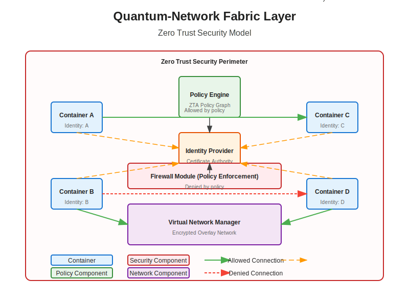

# Firewall Module Documentation

## Overview

The Firewall Module is a critical security component of the Quantum-Network Fabric Layer that enforces Zero Trust network policies. It provides fine-grained control over container communication, implementing the principle of "never trust, always verify" to ensure that only authorized connections are permitted.

## Architecture

The Firewall Module consists of the following components:

- **Firewall Manager**: Central controller for firewall operations
- **Policy Engine**: Evaluates connection requests against security policies
- **Rule Manager**: Translates policies into firewall rules
- **Backend Providers**: Implementations for different firewall technologies (iptables, nftables)

## Firewall Manager

The Firewall Manager (`FirewallManager`) is the central component that:

- Initializes and configures the firewall subsystem
- Integrates with the Zero Trust policy graph
- Manages firewall rules for container networks
- Coordinates with the Virtual Network Manager
- Provides an API for rule management

### Configuration

The Firewall Manager can be configured through the `FirewallConfig` structure:

```rust
pub struct FirewallConfig {
    pub backend: FirewallBackend,
    pub default_policy: FirewallPolicy,
    pub connection_tracking: bool,
    pub log_denied: bool,
    pub log_level: LogLevel,
    pub metrics_enabled: bool,
}
```

Default configuration:
- Backend: nftables
- Default Policy: Deny
- Connection Tracking: Enabled
- Log Denied: Enabled
- Log Level: Info
- Metrics: Enabled

## Firewall Backends

The Firewall Module supports multiple backend implementations:

### nftables Backend

The nftables backend is the default and recommended implementation:

- Uses the modern Linux nftables framework
- Provides better performance and flexibility
- Supports atomic rule updates
- Implements advanced matching capabilities
- Offers better integration with the kernel

### iptables Backend

The iptables backend is provided for compatibility:

- Uses the traditional Linux iptables framework
- Widely supported across Linux distributions
- Compatible with older kernels
- Familiar to many administrators
- Limited atomic update capabilities

## Zero Trust Policy Integration

The Firewall Module integrates with the Zero Trust Architecture:

- **Policy Graph**: Connects to the central ZTA policy graph
- **Identity Verification**: Validates container identities
- **Attribute-Based Access Control**: Uses container attributes for policy decisions
- **Continuous Verification**: Re-evaluates policies for ongoing connections
- **Least Privilege**: Enforces minimal access rights



## Firewall Rules

Firewall rules define the allowed and denied traffic patterns:

```rust
pub struct FirewallRule {
    pub id: String,
    pub network_id: String,
    pub priority: u32,
    pub direction: Direction,
    pub protocol: Protocol,
    pub source: NetworkAddress,
    pub destination: NetworkAddress,
    pub source_port_range: PortRange,
    pub destination_port_range: PortRange,
    pub action: Action,
    pub description: Option<String>,
    pub created_at: DateTime<Utc>,
}
```

Key attributes:
- **id**: Unique identifier for the rule
- **network_id**: Associated virtual network
- **priority**: Rule evaluation order (lower numbers = higher priority)
- **direction**: Ingress or Egress
- **protocol**: TCP, UDP, ICMP, or All
- **source/destination**: Network addresses (CIDR, container ID, or group)
- **port_ranges**: Source and destination port ranges
- **action**: Allow, Deny, or Reject

## Rule Evaluation

When a packet traverses the network, the Firewall Module evaluates it against the rules:

1. **Connection Tracking**: Determines if the packet belongs to an established connection
2. **Rule Matching**: Evaluates the packet against rules in priority order
3. **Policy Decision**: Applies the action of the first matching rule
4. **Default Policy**: If no rules match, applies the default policy (typically Deny)
5. **Logging**: Records the decision based on logging configuration

## Network Isolation Implementation

The Firewall Module implements the network isolation modes defined by the Virtual Network Manager:

### Full Isolation

For networks with Full isolation:
- Creates default deny rules for all traffic
- Adds specific allow rules based on Zero Trust policies
- Implements fine-grained access control
- Logs all denied connections

### Peer-Only Isolation

For networks with Peer-Only isolation:
- Allows communication between containers in the same network
- Blocks external traffic by default
- Applies Zero Trust policies for peer communication
- Permits gateway traffic for external connectivity

### Mesh-Only Isolation

For networks with Mesh-Only isolation:
- Allows communication between containers in connected networks
- Blocks external traffic by default
- Applies Zero Trust policies for mesh communication
- Permits gateway traffic for external connectivity

### No Isolation

For networks with No isolation:
- Allows all container communication
- Applies basic network-level filtering
- Maintains connection tracking for stateful filtering
- Provides minimal security controls

## Security Groups

The Firewall Module supports security groups for simplified policy management:

```rust
pub struct SecurityGroup {
    pub id: String,
    pub name: String,
    pub description: Option<String>,
    pub rules: Vec<FirewallRule>,
    pub created_at: DateTime<Utc>,
    pub updated_at: DateTime<Utc>,
}
```

Security groups:
- Group related firewall rules together
- Can be assigned to multiple containers
- Simplify policy management
- Support rule inheritance
- Enable role-based network security

## Dynamic Rule Updates

The Firewall Module supports dynamic rule updates:

- **Rule Addition**: New rules can be added without disrupting existing connections
- **Rule Modification**: Existing rules can be updated with minimal impact
- **Rule Removal**: Rules can be removed when no longer needed
- **Atomic Updates**: Rule sets can be updated atomically
- **Policy Migration**: Smooth transition between policy versions

## Integration with Other Modules

The Firewall Module integrates with:

- **Virtual Network Manager**: For network topology awareness
- **CNI Module**: For container network setup
- **NAT Module**: For external connectivity rules
- **DNS Module**: For name-based filtering
- **Metrics Module**: For security monitoring

## Advanced Features

### Connection Rate Limiting

The Firewall Module can limit connection rates to prevent abuse:

```rust
pub struct RateLimit {
    pub connections_per_second: u32,
    pub burst: u32,
    pub action: Action,
}
```

### Deep Packet Inspection

When configured with appropriate extensions, the Firewall Module can perform basic DPI:

- Protocol validation
- Application layer filtering
- Content inspection
- Signature matching

### Geo-IP Filtering

The Firewall Module supports geographic IP filtering:

- Country-based filtering
- Region-based filtering
- Custom geo-location rules

## Metrics

The Firewall Module exposes the following metrics:

- `firewall_rules_total`: Total number of firewall rules
- `firewall_rule_evaluations_total`: Counter of rule evaluations
- `firewall_allowed_connections_total`: Counter of allowed connections
- `firewall_denied_connections_total`: Counter of denied connections
- `firewall_rule_update_operations_total`: Counter of rule update operations
- `firewall_rule_evaluation_duration_seconds`: Histogram of rule evaluation durations

## Logging

The Firewall Module uses structured logging with the following fields:

- `rule_id`: The ID of the matched rule
- `network_id`: The ID of the network
- `source_ip`: The source IP address
- `destination_ip`: The destination IP address
- `protocol`: The protocol (TCP, UDP, ICMP)
- `source_port`: The source port
- `destination_port`: The destination port
- `action`: The action taken (ALLOW, DENY, REJECT)
- `reason`: The reason for the action

## Example Usage

### Creating Basic Firewall Rules

```rust
let config = FirewallConfig {
    backend: FirewallBackend::Nftables,
    default_policy: FirewallPolicy::Deny,
    ..Default::default()
};

let firewall_manager = FirewallManager::new(config);

// Allow HTTP traffic to a specific container
let rule = FirewallRule {
    id: "rule-123".to_string(),
    network_id: "net-456".to_string(),
    priority: 100,
    direction: Direction::Ingress,
    protocol: Protocol::Tcp,
    source: NetworkAddress::Any,
    destination: NetworkAddress::Container("container-789".to_string()),
    source_port_range: PortRange::Any,
    destination_port_range: PortRange::Single(80),
    action: Action::Allow,
    description: Some("Allow HTTP traffic".to_string()),
    created_at: Utc::now(),
};

firewall_manager.add_rule(rule).await?;
```

### Creating a Security Group

```rust
let security_group = SecurityGroup {
    id: "sg-123".to_string(),
    name: "web-servers".to_string(),
    description: Some("Rules for web servers".to_string()),
    rules: vec![
        // Allow HTTP
        FirewallRule {
            id: "rule-http".to_string(),
            network_id: "net-456".to_string(),
            priority: 100,
            direction: Direction::Ingress,
            protocol: Protocol::Tcp,
            source: NetworkAddress::Any,
            destination: NetworkAddress::Group("sg-123".to_string()),
            source_port_range: PortRange::Any,
            destination_port_range: PortRange::Single(80),
            action: Action::Allow,
            description: Some("Allow HTTP".to_string()),
            created_at: Utc::now(),
        },
        // Allow HTTPS
        FirewallRule {
            id: "rule-https".to_string(),
            network_id: "net-456".to_string(),
            priority: 110,
            direction: Direction::Ingress,
            protocol: Protocol::Tcp,
            source: NetworkAddress::Any,
            destination: NetworkAddress::Group("sg-123".to_string()),
            source_port_range: PortRange::Any,
            destination_port_range: PortRange::Single(443),
            action: Action::Allow,
            description: Some("Allow HTTPS".to_string()),
            created_at: Utc::now(),
        },
    ],
    created_at: Utc::now(),
    updated_at: Utc::now(),
};

firewall_manager.add_security_group(security_group).await?;
firewall_manager.assign_security_group("sg-123", "container-789").await?;
```

## Troubleshooting

Common issues and their solutions:

1. **Unexpected Connection Blocking**: Check rule priorities and default policy
2. **Performance Issues**: Consider optimizing rule count and evaluation order
3. **Rule Conflicts**: Ensure rules don't contradict each other
4. **Backend Failures**: Verify kernel support for the selected backend
5. **Integration Problems**: Check communication with other modules