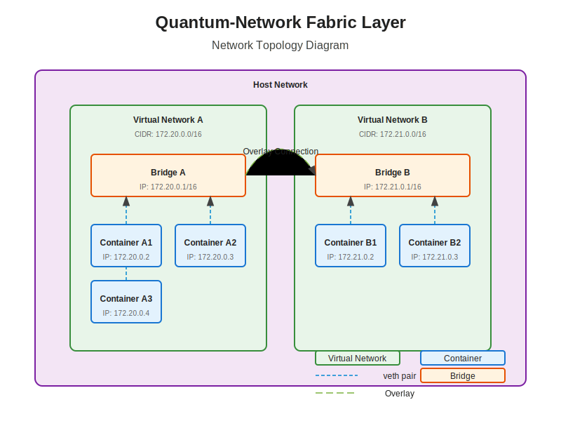

# Virtual Network Module Documentation

## Overview

The Virtual Network (VNet) Module is the core component of the Quantum-Network Fabric Layer that creates and manages isolated network environments for containers. It provides a flexible, secure, and scalable networking solution with support for multiple network drivers and isolation modes.

## Architecture

The Virtual Network Module consists of the following components:

- **VNet Manager**: Central controller for virtual network operations
- **Network Drivers**: Implementations for different network types (Bridge, Overlay, Macvlan, etc.)
- **Endpoint Manager**: Handles container attachment to networks
- **IPAM**: IP Address Management for network subnets


## Virtual Network Manager

The VNet Manager (`VNetManager`) is the central component that:

- Creates and manages virtual networks
- Registers and coordinates network drivers
- Handles network endpoint lifecycle
- Enforces isolation policies
- Integrates with other modules (Firewall, DNS, NAT)

### Configuration

The VNet Manager can be configured through the `VNetConfig` structure:

```rust
pub struct VNetConfig {
    pub default_driver: DriverType,
    pub default_isolation: IsolationMode,
    pub ipv6_enabled: bool,
    pub default_subnet: String,
    pub default_subnet_v6: Option<String>,
    pub max_networks: usize,
    pub metrics_enabled: bool,
}
```

Default configuration:
- Default Driver: Bridge
- Default Isolation: Full
- IPv6: Disabled
- Default Subnet: 172.20.0.0/16
- Max Networks: 1000
- Metrics: Enabled

## Network Drivers

The VNet Module supports multiple network drivers to accommodate different networking requirements:

### Bridge Driver

The Bridge driver creates a Linux bridge for local container networking:

- Creates a Linux bridge device
- Connects containers using veth pairs
- Provides local network isolation
- Supports port mapping for external access
- Ideal for single-host deployments

### Overlay Driver

The Overlay driver creates multi-host networks using encapsulation:

- Uses VXLAN for network encapsulation
- Provides cross-host communication
- Implements distributed routing
- Supports encryption for secure communication
- Ideal for multi-host deployments

### Macvlan Driver

The Macvlan driver connects containers directly to the physical network:

- Assigns MAC addresses to containers
- Provides near-native performance
- Supports multiple modes (bridge, private, vepa, passthru)
- Requires promiscuous mode on host interface
- Ideal for performance-critical applications

### IPvlan Driver

The IPvlan driver shares the host's MAC address:

- Uses the host's MAC address for all containers
- Supports L2 and L3 modes
- Provides better scalability than Macvlan
- Works without promiscuous mode
- Ideal for environments with MAC address limitations

### Host Driver

The Host driver uses the host's network namespace:

- Containers share the host's network stack
- No network isolation
- Maximum performance
- Limited security
- Ideal for specialized use cases

## Network Isolation Modes

The VNet Module supports different isolation modes to control communication between containers:

### Full Isolation

In Full isolation mode:
- Containers can only communicate with explicitly allowed peers
- All traffic is subject to Zero Trust policy verification
- Default deny for all connections
- Highest security level

### Peer-Only Isolation

In Peer-Only isolation mode:
- Containers can communicate with peers in the same network
- External traffic is blocked by default
- Medium security level

### Mesh-Only Isolation

In Mesh-Only isolation mode:
- Containers can communicate with peers in connected networks
- External traffic is blocked by default
- Medium security level with cross-network communication

### No Isolation

In No isolation mode:
- Containers can communicate with any endpoint
- Only basic network-level filtering
- Lowest security level

## Virtual Network Model

A Virtual Network is represented by the `VirtualNetwork` structure:

```rust
pub struct VirtualNetwork {
    pub id: String,
    pub name: String,
    pub cidr: String,
    pub gateway: String,
    pub driver_type: DriverType,
    pub isolation_mode: IsolationMode,
    pub options: HashMap<String, String>,
    pub labels: HashMap<String, String>,
    pub created_at: DateTime<Utc>,
    pub updated_at: DateTime<Utc>,
}
```

Key attributes:
- **id**: Unique identifier for the network
- **name**: Human-readable name
- **cidr**: Network subnet in CIDR notation
- **gateway**: Gateway IP address
- **driver_type**: Network driver (Bridge, Overlay, etc.)
- **isolation_mode**: Network isolation policy
- **options**: Driver-specific options
- **labels**: User-defined metadata

## Endpoint Management

Network endpoints represent container connections to virtual networks:

```rust
pub struct Endpoint {
    pub id: String,
    pub container_id: String,
    pub network_id: String,
    pub ip_address: String,
    pub mac_address: String,
    pub interface_name: String,
    pub created_at: DateTime<Utc>,
}
```

The VNet Manager handles endpoint lifecycle:

1. **Creation**: When a container joins a network
   - IP/MAC address allocation
   - Interface creation
   - Network attachment
   - Security policy application

2. **Management**: During container lifetime
   - Status monitoring
   - Policy updates
   - Performance metrics

3. **Deletion**: When a container leaves a network
   - Interface removal
   - IP/MAC address release
   - Security policy cleanup

## IP Address Management (IPAM)

The VNet Module includes an IPAM system that:

- Manages IP address pools for each network
- Allocates addresses to containers
- Supports static and dynamic allocation
- Handles IPv4 and IPv6 addressing
- Prevents address conflicts

### IPAM Operations

- **Subnet Creation**: When a network is created
- **Address Allocation**: When a container joins a network
- **Address Release**: When a container leaves a network
- **Subnet Deletion**: When a network is removed

## Network Topology

The VNet Module supports complex network topologies:

- **Isolated Networks**: Independent networks with no cross-communication
- **Connected Networks**: Networks with controlled cross-communication
- **Hierarchical Networks**: Parent-child network relationships
- **Mesh Networks**: Fully connected network groups



## Integration with Other Modules

The VNet Module integrates with:

- **Firewall Module**: For network policy enforcement
- **DNS Module**: For name resolution within networks
- **NAT Module**: For external connectivity
- **Bridge Module**: For local network implementation
- **Metrics Module**: For performance monitoring

## Security Features

The VNet Module implements several security features:

- **Network Isolation**: Prevents unauthorized cross-network communication
- **Zero Trust Integration**: All connections require explicit authorization
- **Encrypted Overlay**: Secure communication between hosts
- **MAC/IP Binding**: Prevents address spoofing
- **Traffic Filtering**: Blocks unauthorized traffic patterns


## Performance Considerations

The VNet Module is designed for high performance:

- **Optimized Data Path**: Minimizes packet processing overhead
- **Efficient Resource Usage**: Careful management of system resources
- **Scalability**: Supports thousands of containers and networks
- **Caching**: Reduces lookup overhead for common operations
- **Parallel Processing**: Utilizes multiple cores for network operations

## Metrics

The VNet Module exposes the following metrics:

- `vnet_networks_total`: Total number of virtual networks
- `vnet_endpoints_total`: Total number of endpoints
- `vnet_operations_total`: Counter of network operations by type
- `vnet_operation_errors_total`: Counter of operation errors by type
- `vnet_operation_duration_seconds`: Histogram of operation durations

## Example Usage

### Creating a Bridge Network

```rust
let config = VNetConfig {
    default_driver: DriverType::Bridge,
    default_isolation: IsolationMode::Full,
    ..Default::default()
};

let vnet_manager = VNetManager::new(config);

let network = vnet_manager.create_network(
    "example-network",
    "172.20.0.0/16",
    "172.20.0.1",
    DriverType::Bridge,
    IsolationMode::Full,
    HashMap::new(),
    HashMap::new(),
).await?;

println!("Created network: {}", network.id);
```

### Connecting a Container

```rust
let endpoint = vnet_manager.create_endpoint(
    "container-123",
    "net-456",
    None, // Auto-assign IP
    None, // Auto-assign MAC
).await?;

println!("Container connected with IP: {}", endpoint.ip_address);
```

## Troubleshooting

Common issues and their solutions:

1. **Network Creation Fails**: Check for subnet conflicts or driver availability
2. **Container Cannot Connect**: Verify network existence and capacity
3. **No Connectivity Between Containers**: Check isolation mode and firewall rules
4. **External Connectivity Issues**: Verify NAT configuration
5. **Performance Problems**: Check for resource constraints or driver limitations